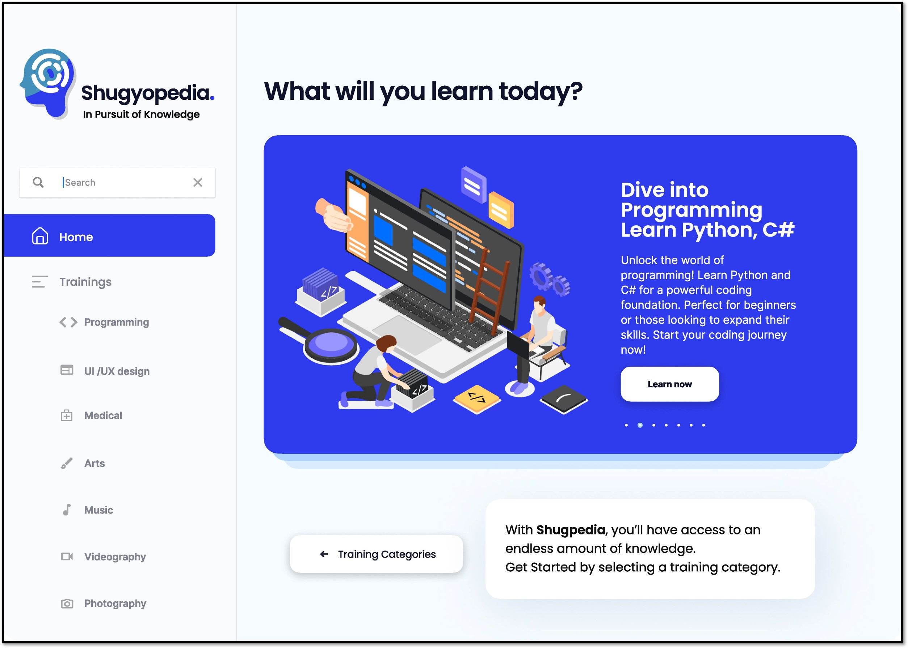
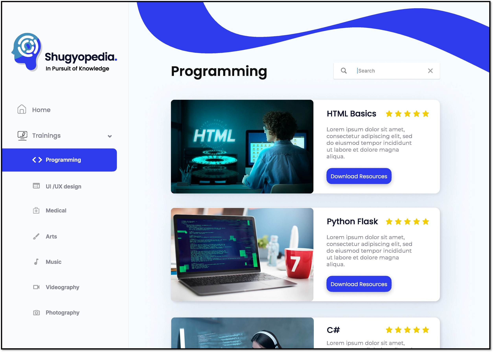
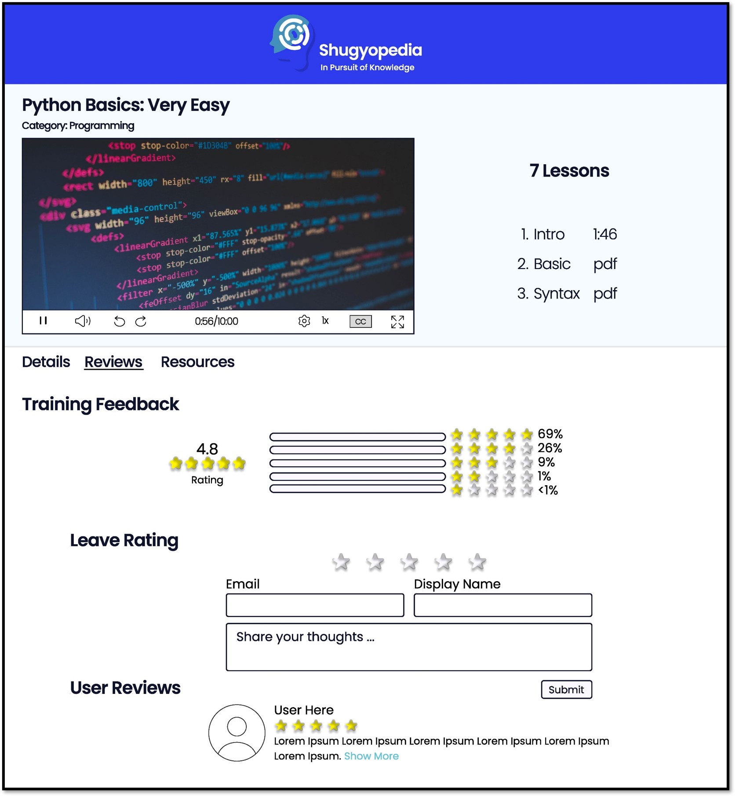

# Shugyopedia: Knowledge Site Web Application  
### Offers wide-array of knowledge and training powered by AI. 

Welcome to ShugyoPedia, your go-to web platform for comprehensive knowledge and diverse training courses across various fields. Here, you'll not only explore but also expand your skills and knowledge base. Engage with ShugyoBot AI, our chatbot companion designed to assist and guide learners throughout their educational journey, empowering them to achieve their learning goals with ease.  

## Training Categories -> Trainings -> Topics -> Resources

The web application stands out with its exceptional hierarchy—Training Categories -> Trainings -> Topics -> Resources. This organized structure ensures effortless navigation, allowing users to seamlessly explore various sections and functionalities. 

## Diverse Trainings

Choose from a multitude of training programs within your selected category, offering a wide array of learning opportunities. 
## Feedback System

Engage with our feedback system! Rate and share insights on specific trainings, shaping an interactive learning community. 

## Admin Monitoring and Control System

The web app includes an admin interface for monitoring and managing aspects of the application, ensuring a smooth operational experience. 

## Technology Stack
* Web Development Framework
  * ASP.NET CORE
  * .NET FRAMEWORK
* OpenAI
    * GPT-3.5 Turbo
* Programming Language and Markups
  * C#
  * JavaScript
  * HTML
  * CSS
* Database (Locally-hosted)
  * MSSQL
* API
  * OpenAI's API (implemented using JavaScript)
* Documentation and Project Management
  * Powerpoint
  * Excel
  * Trello
  * Discord
  * Messenger    

## OUR TEAM
Chloie Marco Quitco - Project Manager 

Charles Cordova - Full-Stack Web Developer, Frontend Engineer, Software Developer 

Dwight Eyac - Technical Manager, Backend Engineer, Database Admin, AI Application Developer 

Moses Anthony Fat - Full-Stack Web Developer, Frontend Engineer, Software Developer 

Harley Davidson Saring - Full-Stack Developer, Lead Frontend Engineer, Software Developer 

## 
© All Rights Reserved 2023 - Group 3 UCMAIN
